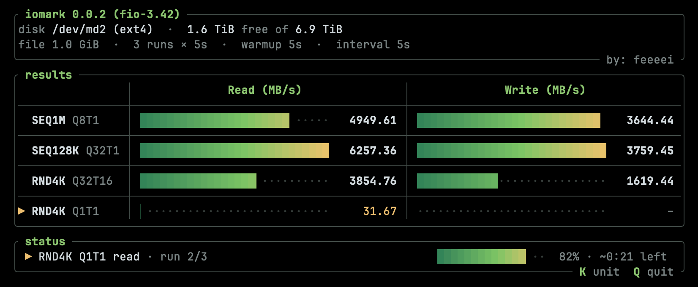

<div align="center">

# iomark

**A CrystalDiskMark-style disk benchmark for the terminal.**<br>
One static binary — [fio](https://github.com/axboe/fio) embedded as the
measurement engine, a btop-style TUI on top.

[](https://github.com/feeeei/iomark/releases/latest)
[](https://github.com/feeeei/iomark/releases/latest)
[](https://github.com/axboe/fio)
[](LICENSE)



</div>

## Features

- **One binary, no dependencies** — fio is statically linked in; nothing is
  extracted or installed at runtime.
- **CrystalDiskMark semantics** — same default workloads (the CDM 9
  "NVMe SSD" preset), same scoring (best of N runs), decimal MB/s. Each task
  measures read then write before moving to the next.
- **Live TUI** — big numbers over proportional bars, updating in real time.
  `K` flips between MB/s and IOPS (the IOPS view also shows mean latency per
  cell), `Q` quits.
- **Scriptable** — `--json` emits one NDJSON object per completed workload;
  non-TTY output degrades to plain lines for CI logs.

## Install

### macOS · Linux

Installs into `~/.local/bin` (works in Git Bash and MSYS2 on Windows too):

```sh
curl -fsSL https://iomark.dev | sh
```

### Windows

Installs into `%LOCALAPPDATA%\Programs\iomark` and adds it to your user `PATH`:

```powershell
irm https://iomark.dev/install.ps1 | iex
```

### Run once, install nothing

`quick` downloads to a temp directory, runs the benchmark and deletes the
binary again:

```sh
curl -fsSL https://iomark.dev | sh -s -- quick            # current directory
curl -fsSL https://iomark.dev | sh -s -- quick /mnt/data  # a specific disk
```

```powershell
& ([scriptblock]::Create((irm https://iomark.dev/install.ps1))) quick D:
```

The installer verifies the download against the release's `SHA256SUMS`.
`--version <tag>` pins a release, `--dir <path>` picks the install directory,
and `uninstall` removes the binary again. Prebuilt archives for every platform
are also on the [releases page](https://github.com/feeeei/iomark/releases).

## Usage

```sh
iomark                     # benchmark the current directory's disk
iomark /path/to/mount      # benchmark a specific disk
iomark --json > out.ndjson # machine-readable results
```

| Option | Description | Default |
|---|---|---|
| `<TARGET_DIR>` | Directory to benchmark (the test file is created there) | `.` |
| `--tasks <LIST>` | Comma-separated workloads: `(SEQ\|RND)<block>Q<depth>T<threads>` | CDM 9 preset |
| `--type <UNIT>` | Initial display unit, `MB/s` or `IOPS` (`K` toggles in the TUI) | `MB/s` |
| `--runs <N>` | Measured runs per operation, best kept | `3` |
| `--size <SIZE>` | Test file size, binary units | `1GiB` |
| `--duration <TIME>` | Duration of each measured run | `5s` |
| `--warmup <TIME>` | Unmeasured warmup per operation (`0s` disables) | `5s` |
| `--interval <TIME>` | Pause between operations (`0s` disables) | `5s` |
| `--color <MODE>` | `auto`, `truecolor`, `256`, `ansi` or `never` | `auto` |
| `--json` | NDJSON output, one object per workload | off |
| `-V, --version` | Print version (iomark + embedded fio) | |

The default task list is CrystalDiskMark 9's "NVMe SSD" preset,
`SEQ1MQ8T1,SEQ128KQ32T1,RND4KQ32T16,RND4KQ1T1`. Custom workloads follow the
same grammar: `RND8KQ4T4` is random 8 KiB blocks at queue depth 4 with 4
threads.

## Building

```sh
git clone --recurse-submodules https://github.com/feeeei/iomark
cd iomark
cargo build --release
```

Requirements: Rust 1.89+, `make`, a C compiler, `sh`.

| Platform | Notes |
|---|---|
| Linux (x86_64 / ARM64) | `libaio-dev` and `zlib1g-dev` recommended |
| macOS (Apple Silicon / Intel) | works out of the box |
| Windows x86_64 | build inside an MSYS2 **MINGW64** shell with the `x86_64-pc-windows-gnu` toolchain |
| Windows ARM64 | experimental: MSYS2 CLANGARM64 + `aarch64-pc-windows-gnullvm` |

## Methodology

Tasks run in order; each task measures read first, then write (CDM instead
runs every read before any write — a deliberate difference). Each operation
runs one unscored warmup pass, then N scored runs of fixed duration
(`--time_based`); the best bandwidth and the lowest mean latency are
reported, exactly like CrystalDiskMark. The shared test file is written full
of data up front (no sparse-file shortcuts) and deleted on exit — including
on Ctrl-C.

Per-platform fio engines: `libaio` (Linux), `posixaio` (macOS), `windowsaio`
(Windows), always with `direct=1`.

### Comparability notes

- MB/s is decimal (bytes ÷ 10⁶), matching CDM. IOPS and latency come from
  fio's job statistics.
- On macOS there is no `O_DIRECT`; fio's `direct=1` maps to `F_NOCACHE`,
  which is a weaker cache bypass. macOS numbers are comparable to other
  macOS tools (AmorphousDiskMark), not bit-for-bit to Linux/Windows.
- macOS also caps in-flight POSIX AIO per process (`kern.aioprocmax`,
  default 16), so Q32 workloads effectively run at a shallower queue depth
  there; iomark prints a warning when a task exceeds the limit. The caps
  can be raised until reboot (`sudo sysctl kern.aioprocmax=256
  kern.aiomax=1024`), but gains are modest: the kernel services POSIX AIO
  through a small worker-thread pool (`kern.aiothreads`, default 4).
- CDM drives Windows' DiskSpd; iomark drives fio everywhere. Numbers on the
  same hardware land close to CDM's but are not guaranteed identical.

## License

GPL-2.0-only — iomark statically links fio, which is GPL-2.0. See
[LICENSE](LICENSE).
